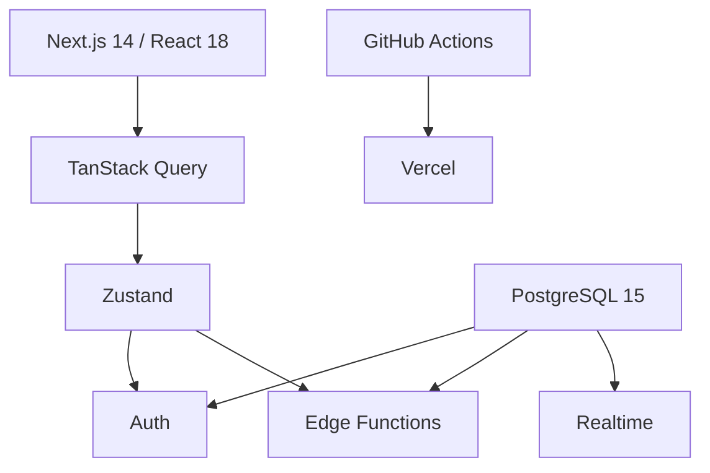
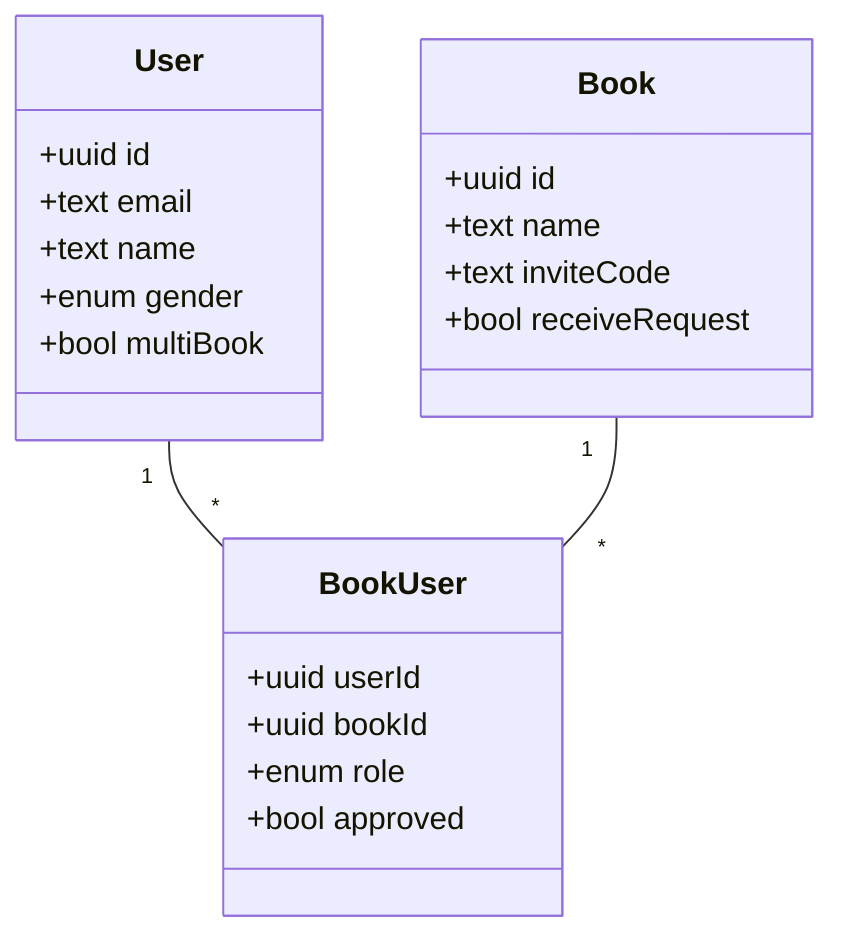
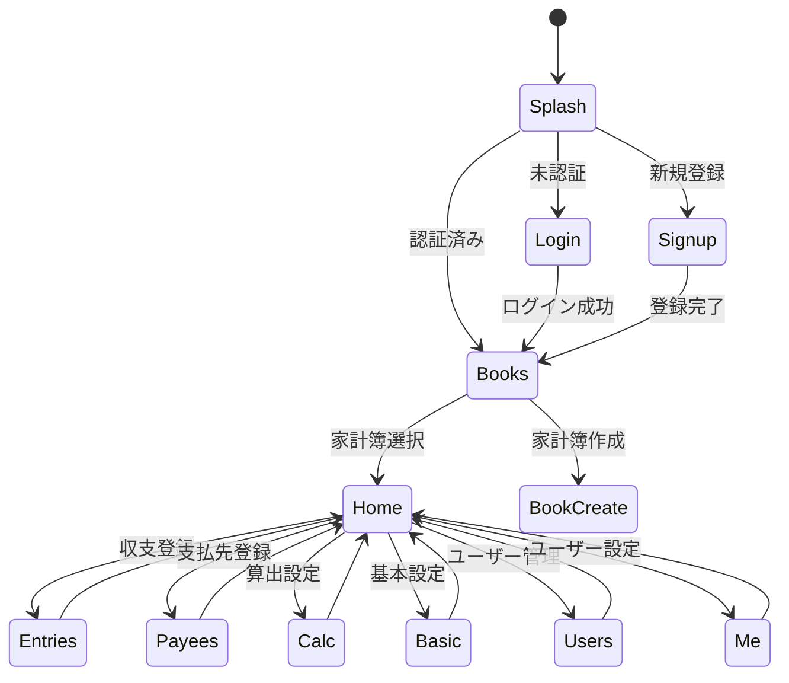

# DUWALLET - 共同家計簿アプリ

複数ユーザーが共同で管理する家計簿をスマートフォン中心に利用するPWAです。収入割合方式または残金均一方式で月次支払額を自動算出し、支払先・支払期限も含めて可視化します。

## 環境構築

### 要件

- Node.js 18.0.0以上
- pnpm 8.0.0以上
- Docker Compose

### セットアップ

```bash
# リポジトリのクローン
git clone https://github.com/yourusername/duwallet.git
cd duwallet

# 依存関係のインストール
npm install -g pnpm
pnpm install

# 環境変数の設定
cp .env.example .env

# Supabaseローカル環境の起動
docker compose up -d supabase
```

### 開発サーバーの起動

```bash
pnpm dev
```

アプリケーションは [http://localhost:3000](http://localhost:3000) で利用できます。

### テスト実行

```bash
# ユニットテスト
pnpm test

# E2Eテスト
pnpm playwright test --reporter=line
```

## プロジェクト構成

- `/apps/web` - Next.js 14アプリケーション (App Router)
- `/packages/ui` - 共有UIコンポーネント
- `/supabase` - Supabase関連ファイル (マイグレーション、Edge Functions)
- `/docs` - プロジェクトドキュメント

## 技術スタック

- フロントエンド: Next.js 14, TypeScript, TailwindCSS, shadcn/ui
- 状態管理: Zustand, TanStack Query
- バックエンド: Supabase (PostgreSQL, Auth, Storage)
- テスト: Jest, React Testing Library, Playwright

## 1. プロダクト概要

`duwallet` は複数ユーザーが共同で管理する家計簿を、収入割合や残金に応じた独自ロジックで自動割勘し、決済期限も含めて一元管理できる PWA です。主目的は夫婦 2 名での利用ですが、ユーザー数拡張やチーム利用を想定したスケーラビリティも確保します。アプリ名は _duet / duo_ + _wallet_ に由来します。

## 2. アーキテクチャ概要



## 3. 技術スタック（決定版）

| 層                  | 採用技術                                                             | 主な役割                     | 採用理由                                         |
| ------------------- | -------------------------------------------------------------------- | ---------------------------- | ------------------------------------------------ |
| フロントエンド      | **Next.js 14 (App Router)**, **React 18**, **TypeScript**            | SPA/PWA                      | ファイルルーティング + SSG/ISR、Vercel との相性  |
| UI / スタイリング   | **Tailwind CSS 3**, **shadcn/ui**, **class-variance-authority**      | デザインシステム             | 最小 CSS、コンポーネントのカスタマイズ性         |
| 状態管理            | **TanStack Query**, **Zustand**                                      | API キャッシュ / UI 状態     | データ取得の最適化とシンプルなグローバルステート |
| バリデーション      | **React Hook Form + Zod**                                            | フォーム & 型安全            | 型定義とスキーマを共有                           |
| 日付操作            | **date-fns**                                                         | ローカライズ対応             | 軽量、tree-shakable                              |
| 通貨/単位           | **Intl.NumberFormat (¥)**                                            | 金額表示                     | 日本円専用で実装                                 |
| PWA                 | **next-pwa**                                                         | キャッシュ戦略／オフライン   | 設定が簡易で iOS 対応実績あり                    |
| 認証 / データベース | **Supabase (PostgreSQL + Auth + Storage + Realtime)**                | BaaS                         | 無料枠が広く、RLS による高いセキュリティ         |
| サーバーロジック    | **Supabase Edge Functions (TypeScript)**                             | ビジネスロジック             | 無料・Deno 実行環境、低レイテンシ                |
| CI / CD             | **GitHub Actions**, **Vercel**, **Supabase CLI**                     | テスト／自動デプロイ         | OSS かつ無料枠で完結                             |
| テスト              | **Jest**, **@testing-library/react**, **Playwright**                 | 単体／結合／E2E              | PWA シナリオも網羅                               |
| 品質ツール          | **ESLint**, **Prettier**, **Husky**, **lint-staged**, **commitlint** | コードスタイル統一           | DX 向上                                          |
| 開発環境            | **Docker Compose**                                                   | ローカル DB & Edge Functions | Windows でも環境差分無し                         |

> 💰 **コスト試算**: フロント (Vercel Hobby)、バックエンド (Supabase Free) で月額 $0 運用が可能。

## 4. 非機能要件

| 分類             | 指標               | 目標値                       |
| ---------------- | ------------------ | ---------------------------- |
| パフォーマンス   | LCP                | ≤ 2.5 s (3G 回線)            |
| レイテンシ       | API 往復           | ≤ 150 ms (99 パーセンタイル) |
| オフライン       | キャッシュ保持期間 | 12 ヶ月分のトランザクション  |
| セキュリティ     | RLS 適用率         | 100 %                        |
| アクセシビリティ | WCAG               | 2.1 AA 準拠                  |
| 可用性           | フロント SLA       | 99.9 % (Vercel)              |
| 保守性           | API カバレッジ     | 単体テスト 90 % + E2E 30 %   |

## 5. 辛口レビュー & 添削ポイント（旧基本設計へのフィードバック）

1. **画面 ID が未付与**
   - 追跡・テストケース作成時に参照が困難。→ 全画面に `A-xx` 形式の ID を付与。
2. **入力バリデーション要件の欠落**
   - フロント／DB 双方でスキーマが曖昧。→ Zod スキーマを単一ソース化。
3. **エラー UX の不在**
   - 失敗時フローが定義されていない。→ トースト + フォームフィードバックを明示。
4. **用語の不統一**
   - 「参加ユーザー」「ユーザー」「メンバー」が混在。→ ドメイン語彙を README で統一。
5. **非機能要件がゼロ**
   - パフォーマンス・セキュリティ指標が未定義。→ [非機能要件] セクションを新設。
6. **権限管理が粗い**
   - RLS 方針やロールレベルの詳細が不足。→ DB 設計 YAML で詳細管理。
7. **オフライン & ネットワーク障害時考慮無し**
   - PWA であるなら必須。→ SW による IndexedDB キャッシュを設計。
8. **月遷移ロジックが UI 側に埋め込み予定**
   - サーバー側で月締め処理を関数化し、バッチ or Edge Function Cron で実行するべき。
9. **通貨・端数処理定義が曖昧**
   - `Intl.NumberFormat` と DB 側 numeric(12,2) で統一。切上げ桁を config にする。
10. **ユースケース図が無い**
    - 開発者以外のステークホルダーが動作を把握しづらい。→ docs/specs 配下に UML を追加。

## 6. 基本設計（改訂版）

以下は上記フィードバックを反映した新版です。表形式で全項目を漏れなく記載しています。

### 6.1 画面一覧

| ID   | 画面名                  | URL                           | 主機能                     | 権限   | 備考                                              |
| ---- | ----------------------- | ----------------------------- | -------------------------- | ------ | ------------------------------------------------- |
| A-01 | タイトル / スプラッシュ | /                             | ロゴ表示、認証状態チェック | 全員   | 3 秒表示後、自動遷移                              |
| A-02 | ログイン                | /login                        | Email+PW、Biometric        | 未認証 | Supabase OTP 対応                                 |
| A-03 | 新規登録                | /signup                       | ユーザー登録               | 未認証 | メール確認によるアクティベーション                |
| B-01 | 家計簿選択              | /books                        | 家計簿名一覧取得           | 認証   | 参加コード入力 (モーダル)・家計簿作成ボタンを含む |
| B-02 | 家計簿作成              | /books/new                    | 家計簿登録                 | 認証   | 参加コード自動生成／手動入力切替                  |
| C-01 | ホーム                  | /books/:bookId                | 月次サマリ                 | 参加者 | 月遷移 UI、Skeleton                               |
| C-02 | 月次収支登録            | /books/:bookId/entries        | 収支 CRUD                  | 参加者 | RHF + Zod、対象月プルダウン                       |
| C-03 | 支払先登録              | /books/:bookId/payees         | 支払先 CRUD                | 管理者 |                                                   |
| C-04 | 支払額算出設定          | /books/:bookId/settings/calc  | 支払額ロジック             | 管理者 | 動的プレビュー                                    |
| C-05 | 基本設定編集            | /books/:bookId/settings/basic | 名称・参加コード           | 管理者 |                                                   |
| C-06 | 参加ユーザー管理        | /books/:bookId/users          | ロール管理                 | 管理者 | RLS 越権不可                                      |
| D-01 | ユーザー設定            | /me                           | プロフィール編集           | 認証   |                                                   |

### 6.2 ドメインモデル（抜粋）



> DB 詳細は `docs/specs/database_schema.yaml` を参照。

### 6.3 算出ロジック & 変数定義

| 変数           | 意味                          | 出典                     |
| -------------- | ----------------------------- | ------------------------ |
| `userIncome`   | 対象ユーザーの月次収入合計    | 月次収支テーブル `Entry` |
| `totalIncome`  | 全参加ユーザー月次収入合計    | 同上                     |
| `sharedIncome` | 共通収入額                    | 同上                     |
| `userExpense`  | 対象ユーザー月次支出合計      | 同上                     |
| `totalExpense` | 全参加ユーザー月次支出合計    | 同上                     |
| `memberCount`  | 家計簿参加ユーザー数          | `BookUser`               |
| `totalDue`     | 月次支払総額（支払先合算）    | `Payee` / 算出設定       |
| `roundDigit`   | 切上げ桁 (10^n)               | 算出設定 `CalcSetting`   |
| `incomeSource` | 収入参照先 (`prev` or `curr`) | 設定画面でユーザーが選択 |

1. **収入割合方式** `payable = totalDue * (userIncome / (totalIncome - sharedIncome))`
2. **残金均一方式** `payable = userIncome - ((totalIncome - totalExpense) / memberCount)`
3. **ベース支払率 (BasePayRatio)**方式 1 の比率または方式 2 から導出した `payable / totalDue` を基準とし、管理者は ±(memberCount-1)% まで補正可。補正された比率は他メンバーに等分で反映。
4. **端数処理** `ceil(payable / roundDigit) * roundDigit`
5. **収入参照先選択**
   月次計算前に `incomeSource` で「前月」または「今月」を指定。前月データが無い場合は今月固定。

### 6.4 画面遷移図



## 7. 実装方針（AI エージェント運用）

1. **docs/specs** 配下に YAML 形式で _仕様・詳細設計・テックスタック・ディレクトリ構成・DB 定義・テスト計画_ を分離保存する。
2. タスクは **docs/tasks/pending** に粒度最小で配置し、完了後 **docs/tasks/done** へ移動。
3. 依存関係は `task_manager.yaml` で DAG 管理し、直列／並列を明示。
4. 各セッション開始時に AI エージェントは必ず上記 YAML をパースし、矛盾が無いか検証する。
5. コード生成後は **CI (GitHub Actions)** で `pnpm test && playwright test --reporter=line` を通過するまでは完了としない。
6. **省略禁止 / ハルシネーションゼロ** を遵守し、変更差分は明示的に Pull Request で共有する。

---

## 8. ドメイン語彙集

| 用語           | 英語        | 定義                                                           |
| -------------- | ----------- | -------------------------------------------------------------- |
| ユーザー       | User        | アプリにログインする個人。email, name, password を保持         |
| 家計簿         | Book        | 共同家計簿の単位。inviteCode で参加者を招待                    |
| 参加ユーザー   | BookUser    | User と Book の中間エンティティ。role と approved フラグを持つ |
| 月次収支       | Entry       | 月ごとの収入・支出・共有収入・共有支出を保持するレコード       |
| 支払先         | Payee       | 家計簿に紐づく請求先（例: 楽天、家賃）                         |
| 支払額算出設定 | CalcSetting | 支払額算出方式、端数処理などの設定                             |
| 支払率         | PayRatio    | 各ユーザーの支払負担率 (合計100%)                              |

> 本語彙集は UI／ドキュメント／コード識別子で統一的に使用すること。

---

> 本 README は 2024-06-XX に全面改訂されました。以前の内容は Git 履歴を参照してください。
