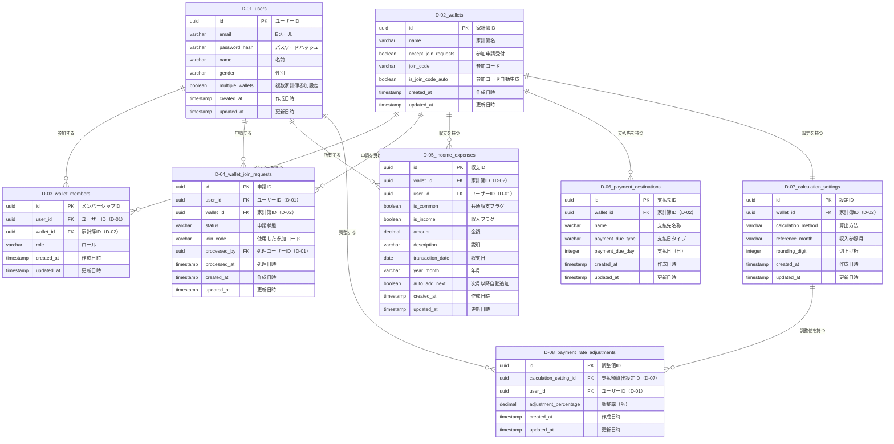

# duwalletデータベースのテーブル一覧

このファイルはduwalletアプリのデータベース定義に関するテーブル一覧を示しています。

## テーブル一覧

| テーブル番号 | テーブル名                   | 説明                                                       | 関連テーブル                                                                |
|------------|----------------------------|----------------------------------------------------------|----------------------------------------------------------------------------|
| D-01       | users                        | ユーザー情報を管理するテーブル                             | wallet_members, wallet_join_requests                                        |
| D-02       | wallets                      | 家計簿の基本情報を管理するテーブル                         | wallet_members, wallet_join_requests, income_expenses, payment_destinations |
| D-03       | wallet_members               | 家計簿とユーザーの関連（メンバーシップ）を管理するテーブル | users, wallets                                                              |
| D-04       | wallet_join_requests         | 家計簿への参加申請を管理するテーブル                       | users, wallets                                                              |
| D-05       | income_expenses              | 収支情報を管理するテーブル                                 | wallets, users                                                              |
| D-06       | payment_destinations         | 支払先を管理するテーブル                                   | wallets                                                                     |
| D-07       | calculation_settings         | 支払額の算出設定を管理するテーブル                         | wallets                                                                     |
| D-08       | payment_rate_adjustments     | ユーザーごとの支払率調整値を管理するサブテーブル           | calculation_settings, users                                                 |

## 各テーブルの概要

### D-01: users

ユーザーの基本情報を管理します。認証情報と個人設定を含みます。

### D-02: wallets

家計簿の基本情報を管理します。名称、参加コード、参加申請受付設定などを含みます。

### D-03: wallet_members

どのユーザーがどの家計簿に属しているか、そのロール（管理者/一般）などの関連情報を管理します。

### D-04: wallet_join_requests

家計簿への参加申請の状態を管理します。申請中、承認済み、却下などの状態を含みます。

### D-05: income_expenses

各家計簿の収支情報を管理します。ユーザー別の収支と共通収支の両方を含み、日付、金額、説明、自動追加設定などの情報を保持します。

### D-06: payment_destinations

支払先の情報を管理します。支払先の名称、支払日（固定日または月末）などを含みます。

### D-07: calculation_settings

支払額の算出方法に関する設定を管理します。算出方法（収入割合方式/残金均一方式）、切上げ桁、収入参照月などの設定を含みます。

### D-08: payment_rate_adjustments

計算方法から自動算出される支払率を調整するための値を保持します。calculation_settingsテーブルのサブテーブルとして機能します。

## ER図

