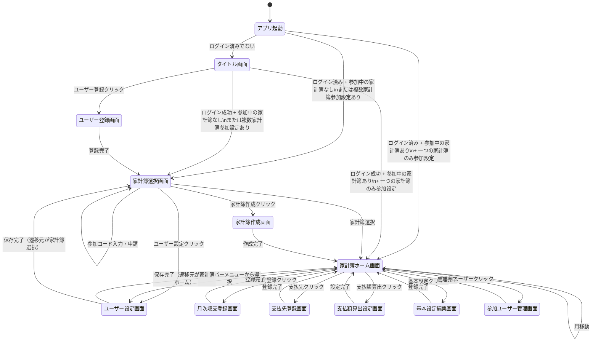

# 画面一覧

## アプリ画面一覧

1. **タイトル画面** (ID: S-01, file: S-01_title)：アプリ名表示、ログイン、ユーザー登録、起動時自動遷移ロジック
2. **ユーザー登録画面** (ID: S-02, file: S-02_user_register)：ユーザー情報入力、登録
3. **家計簿選択画面** (ID: S-03, file: S-03_wallet_select)：家計簿選択、家計簿作成、家計簿参加申請、申請中の家計簿数表示、ユーザー設定
4. **家計簿作成画面** (ID: S-04, file: S-04_wallet_create)：基本設定項目入力、作成
5. **家計簿ホーム画面** (ID: S-05, file: S-05_wallet_home)：表示項目の表示(ユーザー別収支・共通収支)、月移動、ハンバーガーメニュー・サイドバーでの機能アクセス、認証管理
6. **月次収支登録画面** (ID: S-06, file: S-06_monthly_income_expense)：収支日付選択、次月以降自動追加設定、登録済み収支の表示・編集・削除、認証管理
7. **支払先登録画面** (ID: S-07, file: S-07_payment_destination)：支払先情報入力、登録
8. **支払額算出設定画面** (ID: S-08, file: S-08_calculation_settings)：算出方法選択、ユーザー別支払額表示、ユーザー別支払率表示、支払率編集、切上げ桁編集、収入参照月選択、認証管理
9. **基本設定編集画面** (ID: S-09, file: S-09_basic_settings)：基本設定項目入力、登録
10. **参加ユーザー管理画面** (ID: S-10, file: S-10_member_management)：参加ユーザーの表示、申請ユーザーの表示、参加ユーザーのロール選択、申請ユーザーの承認/却下
11. **ユーザー設定画面** (ID: S-11, file: S-11_user_settings)：ユーザー情報項目、保存、遷移元画面への戻り、認証管理

## 起動時自動遷移ロジック

アプリ起動時、以下の条件に基づいて自動的に適切な画面に遷移します：

1. ログイン済みでない場合：

   - タイトル画面（S-01）を表示
2. ログイン済みで、参加中の家計簿がない場合：

   - 家計簿選択画面（S-03）に遷移
3. ログイン済みで、参加中の家計簿があり、複数家計簿に参加する設定の場合：

   - 家計簿選択画面（S-03）に遷移
4. ログイン済みで、参加中の家計簿があり、一つの家計簿のみに参加する設定の場合：

   - 家計簿ホーム画面（S-05）に直接遷移

この起動ロジックを実装するために、[アクティブウォレットパターン](アクティブウォレットパターン.md)を採用しています。このパターンにより、URLから家計簿IDを省略し、代わりに「現在選択中の家計簿」という概念を導入しています。詳細については、リンク先のドキュメントを参照してください。

## 画面遷移図

